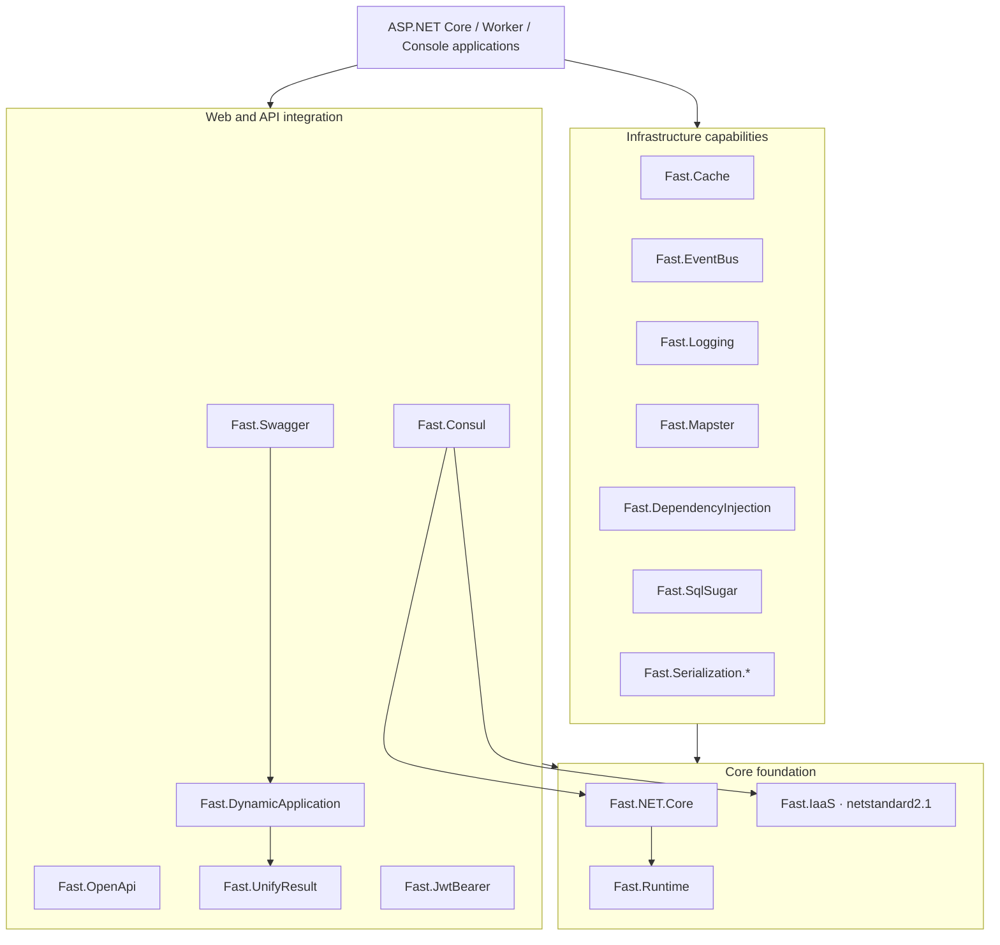

[简体中文](./README.zh.md) | **English**

<p align="center">
	
</p>

<h1 align="center">Fast.NET</h1>

<p align="center">
	<a href="https://www.nuget.org/packages/Fast.NET.Core"></a>
	<a href="https://www.nuget.org/packages/Fast.NET.Core"></a>
	<a href="./LICENSE"></a>
</p>

A modular infrastructure SDK for modern .NET applications, composed through independent NuGet packages.

**[Documentation](http://docs.fastdotnet.cn/en-US/backend/fast-net/) · [Official website](http://fastdotnet.com)**

## Why Fast.NET

- **Modular by design**: 17 independent packages keep unrelated dependencies out of your application.
- **Supported .NET releases**: the primary modules target `net8.0`, `net9.0`, and `net10.0` together.
- **Reusable foundation**: `Fast.IaaS` stays on `netstandard2.1` for broad reuse across modern .NET projects.
- **Idiomatic integration**: consistent extension methods for `IServiceCollection`, `WebApplicationBuilder`, and `IApplicationBuilder`.
- **Independent adoption**: caching, logging, serialization, data access, and other modules can be used without adopting the entire stack.
- **Release ready**: deterministic builds, centrally managed dependencies, vulnerability auditing, symbol packages, CI, and an explicitly confirmed publishing script.

## Compatibility

| Item | Supported range |
| --- | --- |
| Primary SDK modules | `net8.0; net9.0; net10.0` |
| `Fast.IaaS` | `netstandard2.1` |
| Build SDK | .NET SDK `10.0.100` selected by [`global.json`](global.json), with roll-forward to newer feature bands |
| C# language version | C# 14 |
| License | Apache-2.0 |

`netstandard2.1` does not support the classic .NET Framework. Applications that still run on .NET Framework require a separate compatibility assessment.

## Quick start

Install the three modules used by this starter in an existing ASP.NET Core project:

```bash
dotnet add package Fast.NET.Core
dotnet add package Fast.Serialization.System.Text.Json
dotnet add package Fast.Swagger
```

```csharp
using Fast.NET.Core;
using Fast.Serialization;
using Fast.Swagger;

var builder = WebApplication.CreateBuilder(args);

builder.Initialize();
builder.Services.AddSerialization();
builder.Services.AddControllers();
builder.Services.AddSwaggerDocuments(builder.Configuration);

var app = builder.Build();

app.UseSwaggerDocuments();
app.MapControllers();
app.MapGet("/health", () => Results.Ok(new { status = "ok" }));

app.Run();
```

This example does not register a database, Redis or background jobs. Add other modules and their configuration only when needed. Module versions are maintained independently; review [CHANGELOG](./CHANGELOG.md) before upgrading.

## Architecture



This diagram presents the responsibility layers. See the [architecture guide](docs/ARCHITECTURE.md) for actual project references, startup flow, and extension boundaries.

## Package catalog

| NuGet package | Primary capability | Target frameworks | Source |
| --- | --- | --- | --- |
| [`Fast.Runtime`](https://www.nuget.org/packages/Fast.Runtime) | ASP.NET Core runtime foundation, contexts, and shared extensions | .NET 8–10 | [`src/Runtime`](src/Runtime) |
| [`Fast.IaaS`](https://www.nuget.org/packages/Fast.IaaS) | General extensions, validation, file, and cryptography utilities | .NET Standard 2.1 | [`src/IaaS`](src/IaaS) |
| [`Fast.NET.Core`](https://www.nuget.org/packages/Fast.NET.Core) | Application initialization, configuration loading, CORS, and compression | .NET 8–10 | [`src/Core`](src/Core) |
| [`Fast.Cache`](https://www.nuget.org/packages/Fast.Cache) | Redis caching built on CSRedisCore | .NET 8–10 | [`src/Cache`](src/Cache) |
| [`Fast.Consul`](https://www.nuget.org/packages/Fast.Consul) | Consul service registration, health checks, and KV integration | .NET 8–10 | [`src/Consul`](src/Consul) |
| [`Fast.DependencyInjection`](https://www.nuget.org/packages/Fast.DependencyInjection) | Convention-based dependency injection and service scanning | .NET 8–10 | [`src/DependencyInjection`](src/DependencyInjection) |
| [`Fast.DynamicApplication`](https://www.nuget.org/packages/Fast.DynamicApplication) | Dynamic APIs and application service discovery | .NET 8–10 | [`src/DynamicApplication`](src/DynamicApplication) |
| [`Fast.EventBus`](https://www.nuget.org/packages/Fast.EventBus) | In-process event publishing, subscription, and background consumption | .NET 8–10 | [`src/EventBus`](src/EventBus) |
| [`Fast.JwtBearer`](https://www.nuget.org/packages/Fast.JwtBearer) | JWT Bearer configuration, authentication, and authorization helpers | .NET 8–10 | [`src/JwtBearer`](src/JwtBearer) |
| [`Fast.Logging`](https://www.nuget.org/packages/Fast.Logging) | Console and file logging extensions | .NET 8–10 | [`src/Logging`](src/Logging) |
| [`Fast.Mapster`](https://www.nuget.org/packages/Fast.Mapster) | Mapster object-mapping integration | .NET 8–10 | [`src/Mapster`](src/Mapster) |
| [`Fast.OpenApi`](https://www.nuget.org/packages/Fast.OpenApi) | OpenAPI models and JavaScript/TypeScript client generation | .NET 8–10 | [`src/OpenApi`](src/OpenApi) |
| [`Fast.Serialization.System.Text.Json`](https://www.nuget.org/packages/Fast.Serialization.System.Text.Json) | System.Text.Json configuration, converters, and data masking | .NET 8–10 | [`src/Serialization.System.Text.Json`](src/Serialization.System.Text.Json) |
| [`Fast.Serialization.Newtonsoft.Json`](https://www.nuget.org/packages/Fast.Serialization.Newtonsoft.Json) | Newtonsoft.Json configuration, converters, and data masking | .NET 8–10 | [`src/Serialization.Newtonsoft.Json`](src/Serialization.Newtonsoft.Json) |
| [`Fast.SqlSugar`](https://www.nuget.org/packages/Fast.SqlSugar) | SqlSugar integration, multi-database settings, repositories, and paging models | .NET 8–10 | [`src/SqlSugar`](src/SqlSugar) |
| [`Fast.Swagger`](https://www.nuget.org/packages/Fast.Swagger) | Swagger documents, grouping, security definitions, and filters | .NET 8–10 | [`src/Swagger`](src/Swagger) |
| [`Fast.UnifyResult`](https://www.nuget.org/packages/Fast.UnifyResult) | RESTful unified responses, exception handling, and validation | .NET 8–10 | [`src/UnifyResult`](src/UnifyResult) |

`Fast.OpenApi` generates TypeScript clients with separate `import type` declarations and explicit `Promise<T>` return types. Actions returning non-generic `Task` or `ValueTask` use `Promise<void>`. `Download` and `Export` actions retain their response: Web clients use `AxiosResponse<Blob>`, while mobile clients allow `Blob`, `ArrayBuffer`, or a temporary-file-path `string`. Their `autoDownloadFile` parameter defaults to `true` and can be disabled by the caller. Other values without a concrete schema remain `unknown`. The output is compatible with `verbatimModuleSyntax` and the current Fast ESLint Config rules. Generated Web and mobile multipart upload methods also expose an optional Axios `onUploadProgress` callback.

## Repository layout

```text
Fast.NET/
├─ src/                         # 17 independently published SDK modules
├─ docs/                        # Bilingual usage, architecture, and release guides
├─ .github/                     # GitHub CI workflow
├─ Directory.Build.props        # Shared target, package, and repository metadata
├─ Directory.Packages.props     # Central NuGet dependency versions
├─ global.json                  # .NET SDK selection policy
├─ Fast.NET.sln                 # Main solution
├─ UploadNuget.bat              # Build, pack, and optional publishing entry point
├─ README.zh.md / README.md     # Chinese and English entry points
└─ LICENSE                      # Apache-2.0 license
```

## Local build

Install a .NET SDK compatible with [`global.json`](global.json), then run:

```bash
dotnet restore Fast.NET.sln
dotnet build Fast.NET.sln -c Release --no-restore
```

Build and pack all SDK projects on Windows:

```bat
UploadNuget.bat pack
```

Create NuGet packages separately:

```bash
dotnet pack Fast.NET.sln -c Release --no-build --no-restore -p:WarnOnPackingNonPackableProject=false
```

Builds don't implicitly create packages. `UploadNuget.bat` explicitly restores, builds, and then packs into `nupkgs`; publishing is an optional final step and always requires an explicit `PUBLISH` confirmation.

## Documentation and collaboration

- [Getting started](http://docs.fastdotnet.cn/en-US/backend/fast-net/guide)
- [Module catalog](http://docs.fastdotnet.cn/en-US/backend/fast-net/modules/)
- [Architecture guide](docs/ARCHITECTURE.md)
- [Comments and public API documentation](docs/COMMENTING_GUIDE.md)
- [Release guide](docs/RELEASING.md)
- [Contribution guide](CONTRIBUTING.md)
- [Security policy](SECURITY.md)
- [Support policy](SUPPORT.md)
- [Code of conduct](CODE_OF_CONDUCT.md)
- [Changelog](CHANGELOG.md)
- [Commit history](https://gitee.com/FastDotnet/Fast.NET/commits/master)
- [Issue tracker](https://gitee.com/FastDotnet/Fast.NET/issues)
- [Pull requests](https://gitee.com/FastDotnet/Fast.NET/pulls)

Before submitting code, build every affected target framework and keep public Chinese and English documentation synchronized.

## Copyright, license and use

Copyright © 2018-Now 小方. This project uses [Apache License 2.0](./LICENSE). Use, modification, distribution and commercial use are permitted subject to its terms.

When redistributing, provide the license, mark modified files and preserve applicable copyright, attribution and supplied NOTICE information as required. This summary does not replace the license or impose additional UI attribution.

Users are responsible for the legal compliance and authorization of their own modifications, deployment, data processing and operations. This reminder is not an additional license condition.

Except as required by applicable law or agreed in writing, the software is provided on an "AS IS" basis. Sections 7 and 8 govern warranty disclaimers and liability limits. Providing the project does not endorse downstream activities or assume users' contractual commitments. This statement does not exclude liability that cannot lawfully be excluded.

## Maintainer

Created and maintained by **Xiao Fang (1.8K Zai)**. Issues and pull requests are welcome to help make Fast.NET a reliable and composable infrastructure option for the .NET ecosystem.
