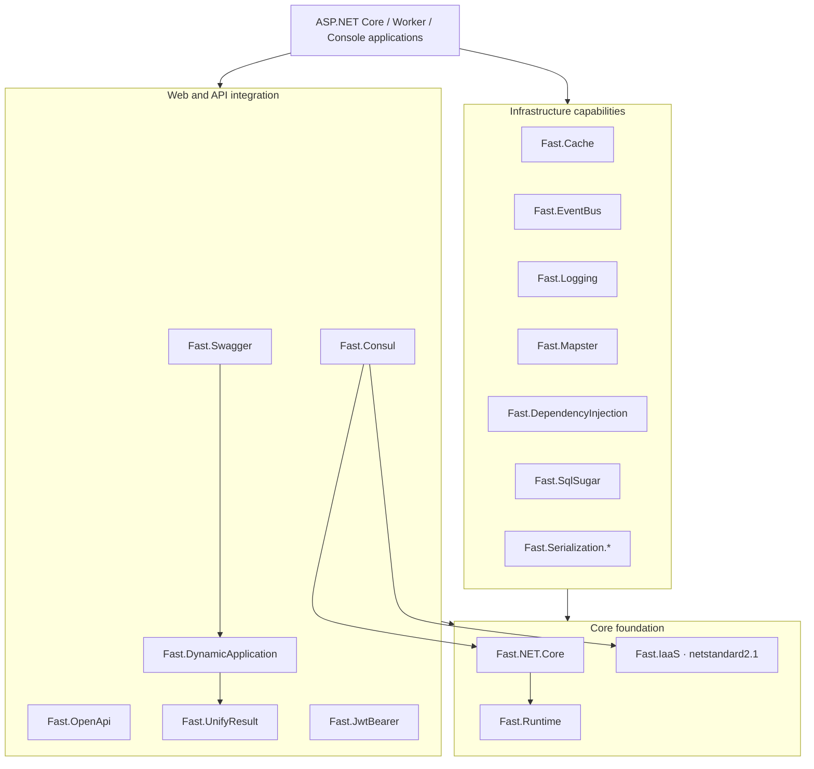

[简体中文](README.zh.md) | [**English**](README.md)

<p align="center">
  
</p>

<h1 align="center">Fast.NET</h1>

<p align="center">
  A modular infrastructure SDK for modern .NET applications
</p>

<p align="center">
  <a href="https://www.nuget.org/packages/Fast.NET.Core"></a>
  <a href="https://www.nuget.org/packages/Fast.NET.Core"></a>
  
  <a href="LICENSE"></a>
</p>

Fast.NET is a set of composable .NET infrastructure libraries covering web application initialization, dependency injection, caching, event handling, logging, object mapping, authentication, data access, serialization, dynamic APIs, unified responses, Swagger/OpenAPI, and Consul integration. Every capability is delivered as an independent NuGet package, so applications reference only the modules they need.

> Fast.NET is not an all-or-nothing framework. It is a family of SDK components with a consistent design and configuration experience for ASP.NET Core, Worker Services, and other modern .NET applications supported by each module.

## Why Fast.NET

- **Modular by design**: 17 independent packages keep unrelated dependencies out of your application.
- **Multi-version support**: the primary modules target `net6.0`, `net7.0`, `net8.0`, `net9.0`, and `net10.0` together.
- **Reusable foundation**: `Fast.IaaS` stays on `netstandard2.1` for broad reuse across modern .NET projects.
- **Idiomatic integration**: consistent extension methods for `IServiceCollection`, `WebApplicationBuilder`, and `IApplicationBuilder`.
- **Independent adoption**: caching, logging, serialization, data access, and other modules can be used without adopting the entire stack.
- **Release ready**: shared XML documentation, NuGet package, symbol package, and repository metadata configuration, plus an interactive Windows publishing script.

## Compatibility

| Item | Supported range |
| --- | --- |
| Primary SDK modules | `net6.0; net7.0; net8.0; net9.0; net10.0` |
| `Fast.IaaS` | `netstandard2.1` |
| Build SDK | .NET SDK `10.0.100` selected by [`global.json`](global.json), with roll-forward to newer feature bands |
| C# language version | C# 12 |
| License | Apache-2.0 |

`netstandard2.1` does not support the classic .NET Framework. Applications that still run on .NET Framework require a separate compatibility assessment.

## Quick start

### 1. Install the modules you need

Fast.NET does not require an umbrella package. Select the NuGet packages needed by your application:

```bash
dotnet add package Fast.NET.Core
dotnet add package Fast.Serialization.System.Text.Json
dotnet add package Fast.Swagger
```

Add Redis caching, JWT authentication, or SqlSugar only when needed:

```bash
dotnet add package Fast.Cache
dotnet add package Fast.JwtBearer
dotnet add package Fast.SqlSugar
```

> `Fast.Serialization.System.Text.Json` and `Fast.Serialization.Newtonsoft.Json` expose serialization extensions with the same style. Most applications should choose one according to their serialization stack.

### 2. Register services

The following ASP.NET Core example combines several modules. Keep only the registrations for packages installed by your application.

```csharp
using Fast.Cache;
using Fast.DependencyInjection;
using Fast.DynamicApplication;
using Fast.EventBus;
using Fast.JwtBearer;
using Fast.Logging;
using Fast.Mapster;
using Fast.NET.Core;
using Fast.OpenApi;
using Fast.Serialization;
using Fast.SqlSugar;
using Fast.Swagger;
using Fast.UnifyResult;

var builder = WebApplication.CreateBuilder(args);

builder.Initialize();
builder.AddCorsAccessor();

builder.Services.AddSerialization();
builder.Services.AddGzipCompression();
builder.Services.AddMapster();
builder.Services.AddDependencyInjection();
builder.Services.AddEventBus();
builder.Services.AddCache();
builder.Services.AddLoggingService(builder.Configuration);
builder.Services.AddSqlSugar(builder.Configuration, builder.Environment);
builder.Services.AddJwtBearer(builder.Configuration);
builder.Services.AddUnifyResult();
builder.Services.AddDynamicApplication();
builder.Services.AddSwaggerDocuments(builder.Configuration);
builder.Services.AddOpenApi(builder.Configuration);
builder.Services.AddControllers();

var app = builder.Build();

app.UseHttpsRedirection();
app.UseStaticFiles();
app.EnableBuffering();
app.UseRouting();
app.UseSwaggerDocuments();
app.MapControllers();

app.Run();
```

For each module's default configuration section and optional parameters, see its `*SettingsOptions` types and extension method XML documentation.

## Architecture



This diagram presents the responsibility layers. See the [architecture guide](docs/ARCHITECTURE.md) for actual project references, startup flow, and extension boundaries.

## Package catalog

| NuGet package | Primary capability | Target frameworks | Source |
| --- | --- | --- | --- |
| [`Fast.Runtime`](https://www.nuget.org/packages/Fast.Runtime) | ASP.NET Core runtime foundation, contexts, and shared extensions | .NET 6–10 | [`src/Runtime`](src/Runtime) |
| [`Fast.IaaS`](https://www.nuget.org/packages/Fast.IaaS) | General extensions, validation, file, and cryptography utilities | .NET Standard 2.1 | [`src/IaaS`](src/IaaS) |
| [`Fast.NET.Core`](https://www.nuget.org/packages/Fast.NET.Core) | Application initialization, configuration loading, CORS, and compression | .NET 6–10 | [`src/Core`](src/Core) |
| [`Fast.Cache`](https://www.nuget.org/packages/Fast.Cache) | Redis caching built on CSRedisCore | .NET 6–10 | [`src/Cache`](src/Cache) |
| [`Fast.Consul`](https://www.nuget.org/packages/Fast.Consul) | Consul service registration, health checks, and KV integration | .NET 6–10 | [`src/Consul`](src/Consul) |
| [`Fast.DependencyInjection`](https://www.nuget.org/packages/Fast.DependencyInjection) | Convention-based dependency injection and service scanning | .NET 6–10 | [`src/DependencyInjection`](src/DependencyInjection) |
| [`Fast.DynamicApplication`](https://www.nuget.org/packages/Fast.DynamicApplication) | Dynamic APIs and application service discovery | .NET 6–10 | [`src/DynamicApplication`](src/DynamicApplication) |
| [`Fast.EventBus`](https://www.nuget.org/packages/Fast.EventBus) | In-process event publishing, subscription, and background consumption | .NET 6–10 | [`src/EventBus`](src/EventBus) |
| [`Fast.JwtBearer`](https://www.nuget.org/packages/Fast.JwtBearer) | JWT Bearer configuration, authentication, and authorization helpers | .NET 6–10 | [`src/JwtBearer`](src/JwtBearer) |
| [`Fast.Logging`](https://www.nuget.org/packages/Fast.Logging) | Console and file logging extensions | .NET 6–10 | [`src/Logging`](src/Logging) |
| [`Fast.Mapster`](https://www.nuget.org/packages/Fast.Mapster) | Mapster object-mapping integration | .NET 6–10 | [`src/Mapster`](src/Mapster) |
| [`Fast.OpenApi`](https://www.nuget.org/packages/Fast.OpenApi) | OpenAPI models, schemas, and type-conversion utilities | .NET 6–10 | [`src/OpenApi`](src/OpenApi) |
| [`Fast.Serialization.System.Text.Json`](https://www.nuget.org/packages/Fast.Serialization.System.Text.Json) | System.Text.Json configuration, converters, and data masking | .NET 6–10 | [`src/Serialization.System.Text.Json`](src/Serialization.System.Text.Json) |
| [`Fast.Serialization.Newtonsoft.Json`](https://www.nuget.org/packages/Fast.Serialization.Newtonsoft.Json) | Newtonsoft.Json configuration, converters, and data masking | .NET 6–10 | [`src/Serialization.Newtonsoft.Json`](src/Serialization.Newtonsoft.Json) |
| [`Fast.SqlSugar`](https://www.nuget.org/packages/Fast.SqlSugar) | SqlSugar integration, multi-database settings, repositories, and paging models | .NET 6–10 | [`src/SqlSugar`](src/SqlSugar) |
| [`Fast.Swagger`](https://www.nuget.org/packages/Fast.Swagger) | Swagger documents, grouping, security definitions, and filters | .NET 6–10 | [`src/Swagger`](src/Swagger) |
| [`Fast.UnifyResult`](https://www.nuget.org/packages/Fast.UnifyResult) | RESTful unified responses, exception handling, and validation | .NET 6–10 | [`src/UnifyResult`](src/UnifyResult) |

## Repository layout

```text
Fast.NET/
├─ src/                         # 17 independently published SDK modules
├─ docs/                        # Architecture and design documentation
├─ translateTool/               # Vue i18n text extraction and update tool
├─ Directory.Build.props        # Shared target, package, and repository metadata
├─ global.json                  # .NET SDK selection policy
├─ Fast.NET.sln                 # Main solution
├─ UploadNuget.bat              # Interactive Windows build and NuGet publisher
├─ README.zh.md / README.md     # Chinese and English entry points
└─ LICENSE                      # Apache-2.0 license
```

## Local build

Install a .NET SDK compatible with [`global.json`](global.json), then run:

```bash
dotnet restore Fast.NET.sln
dotnet build Fast.NET.sln -c Release
```

Create NuGet packages with:

```bash
dotnet pack Fast.NET.sln -c Release --no-restore
```

Windows users can also double-click `UploadNuget.bat` and choose to build only, publish all packages, or publish one selected package.

## Documentation and collaboration

- [Architecture guide](docs/ARCHITECTURE.md)
- [Contribution guide](CONTRIBUTING.md)
- [Localization tool](translateTool/README.md)
- [Commit history](https://gitee.com/FastDotnet/Fast.NET/commits/master)
- [Issue tracker](https://gitee.com/FastDotnet/Fast.NET/issues)
- [Pull requests](https://gitee.com/FastDotnet/Fast.NET/pulls)

Before submitting code, build every affected target framework and keep public Chinese and English documentation synchronized.

## License

Fast.NET is released under the [Apache License 2.0](LICENSE). Use, modification, and distribution must comply with the license and applicable laws.

## Maintainer

Created and maintained by **Xiao Fang (1.8K Zai)**. Issues and pull requests are welcome to help make Fast.NET a reliable and composable infrastructure option for the .NET ecosystem.
