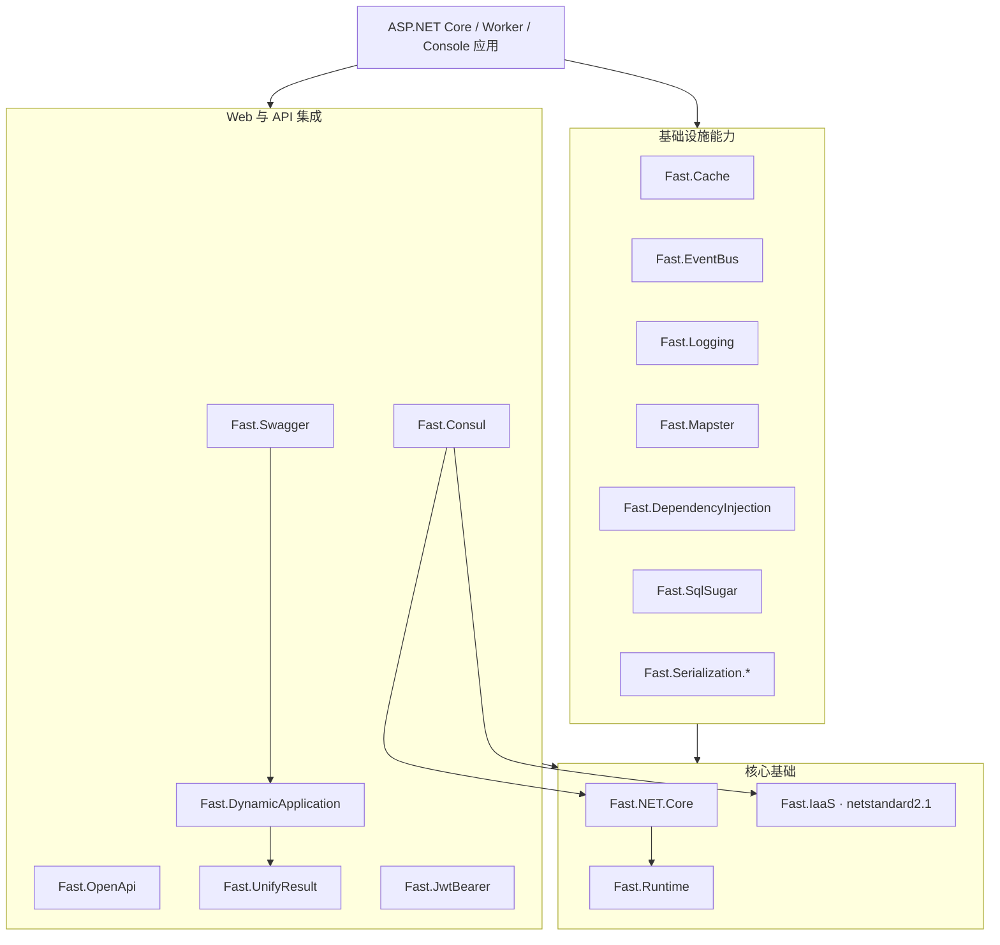

**简体中文** | [English](./README.md)

<p align="center">
	
</p>

<h1 align="center">Fast.NET</h1>

<p align="center">
	<a href="https://www.nuget.org/packages/Fast.NET.Core"></a>
	<a href="https://www.nuget.org/packages/Fast.NET.Core"></a>
	<a href="./LICENSE"></a>
</p>

面向现代 .NET 应用的模块化基础设施 SDK，以独立 NuGet 包按需组合。

**[使用文档](http://docs.fastdotnet.cn/zh-CN/backend/fast-net/) · [官方网站](http://fastdotnet.com)**

## 为什么选择 Fast.NET

- **模块化**：17 个独立包，按需安装，避免无关依赖进入应用。
- **支持期内版本**：主要模块同时支持 `net8.0`、`net9.0`、`net10.0`。
- **通用基础设施**：`Fast.IaaS` 保持 `netstandard2.1`，便于被不同现代 .NET 项目复用。
- **一致的扩展方式**：围绕 `IServiceCollection`、`WebApplicationBuilder` 和 `IApplicationBuilder` 提供惯用扩展方法。
- **可独立采用**：缓存、日志、序列化、数据访问等模块可单独使用，无需绑定完整技术栈。
- **面向发布**：提供确定性构建、集中依赖管理、漏洞审计、符号包、CI 与需明确确认的发布脚本。

## 兼容性

| 项目 | 兼容范围 |
| --- | --- |
| 主要 SDK 模块 | `net8.0; net9.0; net10.0` |
| `Fast.IaaS` | `netstandard2.1` |
| 编译 SDK | 由 [`global.json`](global.json) 固定为 .NET SDK `10.0.100`，允许向后滚动到更新 feature band |
| C# 语言版本 | C# 14 |
| 许可证 | Apache-2.0 |

`netstandard2.1` 不支持传统 .NET Framework。如果应用仍运行在 .NET Framework 上，需要单独评估兼容方案。

## 快速开始

在已有 ASP.NET Core 项目中安装最小示例所需的三个模块：

```bash
dotnet add package Fast.NET.Core
dotnet add package Fast.Serialization.System.Text.Json
dotnet add package Fast.Swagger
```

```csharp
using Fast.NET.Core;
using Fast.Serialization;
using Fast.Swagger;

var builder = WebApplication.CreateBuilder(args);

builder.Initialize();
builder.Services.AddSerialization();
builder.Services.AddControllers();
builder.Services.AddSwaggerDocuments(builder.Configuration);

var app = builder.Build();

app.UseSwaggerDocuments();
app.MapControllers();
app.MapGet("/health", () => Results.Ok(new { status = "ok" }));

app.Run();
```

该示例不注册数据库、Redis 或后台任务；其他模块按需安装，并按模块手册配置。模块版本独立维护，升级前查看 [CHANGELOG](./CHANGELOG.md)。

## 项目架构



这张图展示模块的职责分层；实际项目引用关系、启动流程和扩展边界请参阅[架构说明](docs/ARCHITECTURE.zh.md)。

## 模块目录

| NuGet 包 | 主要能力 | 目标框架 | 源码 |
| --- | --- | --- | --- |
| [`Fast.Runtime`](https://www.nuget.org/packages/Fast.Runtime) | ASP.NET Core 运行时基础、上下文与通用扩展 | .NET 8–10 | [`src/Runtime`](src/Runtime) |
| [`Fast.IaaS`](https://www.nuget.org/packages/Fast.IaaS) | 通用扩展、校验、文件与密码学工具 | .NET Standard 2.1 | [`src/IaaS`](src/IaaS) |
| [`Fast.NET.Core`](https://www.nuget.org/packages/Fast.NET.Core) | 应用初始化、配置加载、CORS、压缩等核心能力 | .NET 8–10 | [`src/Core`](src/Core) |
| [`Fast.Cache`](https://www.nuget.org/packages/Fast.Cache) | 基于 CSRedisCore 的 Redis 缓存封装 | .NET 8–10 | [`src/Cache`](src/Cache) |
| [`Fast.Consul`](https://www.nuget.org/packages/Fast.Consul) | Consul 服务注册、健康检查与 KV 集成 | .NET 8–10 | [`src/Consul`](src/Consul) |
| [`Fast.DependencyInjection`](https://www.nuget.org/packages/Fast.DependencyInjection) | 约定式依赖注入与服务扫描 | .NET 8–10 | [`src/DependencyInjection`](src/DependencyInjection) |
| [`Fast.DynamicApplication`](https://www.nuget.org/packages/Fast.DynamicApplication) | 动态 API 与应用服务发现 | .NET 8–10 | [`src/DynamicApplication`](src/DynamicApplication) |
| [`Fast.EventBus`](https://www.nuget.org/packages/Fast.EventBus) | 进程内事件发布、订阅与后台消费 | .NET 8–10 | [`src/EventBus`](src/EventBus) |
| [`Fast.JwtBearer`](https://www.nuget.org/packages/Fast.JwtBearer) | JWT Bearer 配置、认证与授权辅助 | .NET 8–10 | [`src/JwtBearer`](src/JwtBearer) |
| [`Fast.Logging`](https://www.nuget.org/packages/Fast.Logging) | 控制台与文件日志扩展 | .NET 8–10 | [`src/Logging`](src/Logging) |
| [`Fast.Mapster`](https://www.nuget.org/packages/Fast.Mapster) | Mapster 对象映射集成 | .NET 8–10 | [`src/Mapster`](src/Mapster) |
| [`Fast.OpenApi`](https://www.nuget.org/packages/Fast.OpenApi) | OpenAPI 模型与 JavaScript/TypeScript 客户端生成 | .NET 8–10 | [`src/OpenApi`](src/OpenApi) |
| [`Fast.Serialization.System.Text.Json`](https://www.nuget.org/packages/Fast.Serialization.System.Text.Json) | System.Text.Json 配置、转换器与数据脱敏 | .NET 8–10 | [`src/Serialization.System.Text.Json`](src/Serialization.System.Text.Json) |
| [`Fast.Serialization.Newtonsoft.Json`](https://www.nuget.org/packages/Fast.Serialization.Newtonsoft.Json) | Newtonsoft.Json 配置、转换器与数据脱敏 | .NET 8–10 | [`src/Serialization.Newtonsoft.Json`](src/Serialization.Newtonsoft.Json) |
| [`Fast.SqlSugar`](https://www.nuget.org/packages/Fast.SqlSugar) | SqlSugar、多数据库配置、仓储与分页模型 | .NET 8–10 | [`src/SqlSugar`](src/SqlSugar) |
| [`Fast.Swagger`](https://www.nuget.org/packages/Fast.Swagger) | Swagger 文档、分组、安全定义与过滤器 | .NET 8–10 | [`src/Swagger`](src/Swagger) |
| [`Fast.UnifyResult`](https://www.nuget.org/packages/Fast.UnifyResult) | RESTful 统一响应、异常处理与数据验证 | .NET 8–10 | [`src/UnifyResult`](src/UnifyResult) |

`Fast.OpenApi` 生成的 TypeScript 客户端使用独立的 `import type` 和显式 `Promise<T>` 返回类型。返回非泛型 `Task` 或 `ValueTask` 的接口映射为 `Promise<void>`。`Download`、`Export` 接口保留文件响应：Web 端使用 `AxiosResponse<Blob>`，移动端兼容 `Blob`、`ArrayBuffer` 或临时文件路径 `string`；`autoDownloadFile` 参数默认值为 `true`，调用方可关闭。其他缺少明确 Schema 的值仍映射为 `unknown`。生成结果可直接配合 `verbatimModuleSyntax` 与当前 Fast ESLint Config 规则使用。

## 仓库结构

```text
Fast.NET/
├─ src/                         # 17 个可独立发布的 SDK 模块
├─ docs/                        # 架构、注释规范与发布维护文档
├─ .github/                     # GitHub CI 工作流
├─ Directory.Build.props        # 统一目标框架、打包和仓库元数据
├─ Directory.Packages.props     # 集中管理 NuGet 依赖版本
├─ global.json                  # .NET SDK 选择策略
├─ Fast.NET.sln                 # 主解决方案
├─ UploadNuget.bat              # 构建、打包和可选发布入口
├─ README.zh.md / README.md     # 中英文项目入口
└─ LICENSE                      # Apache-2.0 许可证
```

## 本地构建

安装与 [`global.json`](global.json) 匹配的 .NET SDK 后执行：

```bash
dotnet restore Fast.NET.sln
dotnet build Fast.NET.sln -c Release --no-restore
```

在 Windows 上构建并打包所有 SDK 项目：

```bat
UploadNuget.bat pack
```

单独生成 NuGet 包：

```bash
dotnet pack Fast.NET.sln -c Release --no-build --no-restore -p:WarnOnPackingNonPackableProject=false
```

构建不会隐式打包。`UploadNuget.bat` 会依次还原、构建并将 SDK 包输出到 `nupkgs`；发布是最后的可选步骤，推送前必须明确输入 `PUBLISH`。

## 文档与协作

- [快速开始](http://docs.fastdotnet.cn/zh-CN/backend/fast-net/guide)
- [模块目录](http://docs.fastdotnet.cn/zh-CN/backend/fast-net/modules/)
- [架构说明](docs/ARCHITECTURE.zh.md)
- [注释与公共 API 文档规范](docs/COMMENTING_GUIDE.zh.md)
- [发布指南](docs/RELEASING.zh.md)
- [贡献指南](CONTRIBUTING.zh.md)
- [安全策略](SECURITY.md)
- [支持策略](SUPPORT.md)
- [行为准则](CODE_OF_CONDUCT.md)
- [变更记录](CHANGELOG.md)
- [更新记录](https://gitee.com/FastDotnet/Fast.NET/commits/master)
- [问题反馈](https://gitee.com/FastDotnet/Fast.NET/issues)
- [参与贡献](https://gitee.com/FastDotnet/Fast.NET/pulls)

提交代码前请至少完成受影响目标框架的构建验证，并保持中英文公共文档同步。

## 版权、许可证与使用声明

版权所有 © 2018-Now 小方。本项目依据 [Apache License 2.0](./LICENSE) 开源；在遵守许可证的前提下，可以使用、修改和分发本软件，包括商业使用。

再分发时，应按许可证要求提供许可证副本、对修改的文件作出显著说明，并保留适用的版权和归属声明；包含需要保留的 NOTICE 信息时一并处理。本说明不替代正式许可证，也不额外要求在产品界面展示作者或项目标识。

使用者应就自身使用、二次开发、部署、数据处理及运营活动遵守适用法律和第三方合法权益，自行取得依法需要的授权。上述内容为合规提醒，不构成附加许可条件。

除适用法律另有规定或另有书面约定外，本软件按“原样”提供；保证排除与责任限制以许可证第 7、8 条为准。提供本项目不代表原作者为使用者的二次开发和运营活动背书，也不当然承担其对第三方作出的合同承诺。本说明不排除依法不得排除的责任。

## 维护者

由 **小方（1.8K 仔）** 发起并维护。欢迎通过 Issue 和 Pull Request 参与完善 Fast.NET，为 .NET 生态提供更多可靠、易组合的基础设施选择。
