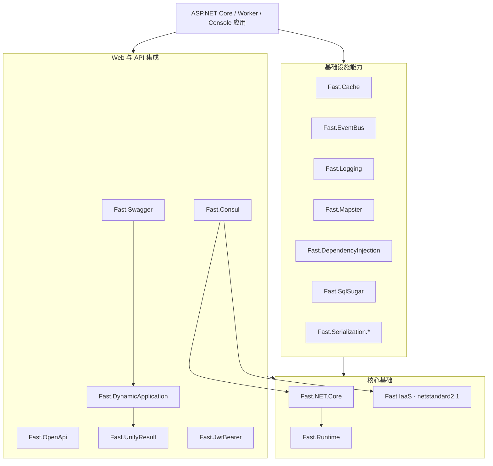

[**简体中文**](README.zh.md) | [English](README.md)

<p align="center">
  
</p>

<h1 align="center">Fast.NET</h1>

<p align="center">
  面向现代 .NET 应用的模块化基础设施 SDK
</p>

<p align="center">
  <a href="https://www.nuget.org/packages/Fast.NET.Core"></a>
  <a href="https://www.nuget.org/packages/Fast.NET.Core"></a>
  
  <a href="LICENSE"></a>
</p>

Fast.NET 是一组可按需组合的 .NET 基础设施库，覆盖 Web 应用初始化、依赖注入、缓存、事件总线、日志、对象映射、认证、数据访问、序列化、动态 API、统一响应、Swagger/OpenAPI 与 Consul 集成。每项能力都以独立 NuGet 包交付，应用只需引用真正需要的模块。

> Fast.NET 不是一个必须整体引入的“大而全”框架。它更像一组具有一致设计和配置体验的 SDK 组件，可用于 ASP.NET Core、Worker Service，以及适合对应模块的其他现代 .NET 应用。

## 为什么选择 Fast.NET

- **模块化**：17 个独立包，按需安装，避免无关依赖进入应用。
- **多版本兼容**：主要模块同时支持 `net6.0`、`net7.0`、`net8.0`、`net9.0`、`net10.0`。
- **通用基础设施**：`Fast.IaaS` 保持 `netstandard2.1`，便于被不同现代 .NET 项目复用。
- **一致的扩展方式**：围绕 `IServiceCollection`、`WebApplicationBuilder` 和 `IApplicationBuilder` 提供惯用扩展方法。
- **可独立采用**：缓存、日志、序列化、数据访问等模块可单独使用，无需绑定完整技术栈。
- **面向发布**：统一生成 XML 文档、NuGet 包和符号包，并提供交互式 Windows 发布脚本。

## 兼容性

| 项目 | 兼容范围 |
| --- | --- |
| 主要 SDK 模块 | `net6.0; net7.0; net8.0; net9.0; net10.0` |
| `Fast.IaaS` | `netstandard2.1` |
| 编译 SDK | 由 [`global.json`](global.json) 固定为 .NET SDK `10.0.100`，允许向后滚动到更新 feature band |
| C# 语言版本 | C# 12 |
| 许可证 | Apache-2.0 |

`netstandard2.1` 不支持传统 .NET Framework。如果应用仍运行在 .NET Framework 上，需要单独评估兼容方案。

## 快速开始

### 1. 安装所需模块

Fast.NET 没有强制性的总包。请选择实际需要的 NuGet 包：

```bash
dotnet add package Fast.NET.Core
dotnet add package Fast.Serialization.System.Text.Json
dotnet add package Fast.Swagger
```

例如，需要 Redis 缓存、JWT 认证或 SqlSugar 时，再分别安装：

```bash
dotnet add package Fast.Cache
dotnet add package Fast.JwtBearer
dotnet add package Fast.SqlSugar
```

> `Fast.Serialization.System.Text.Json` 与 `Fast.Serialization.Newtonsoft.Json` 提供相同风格的序列化扩展。通常根据项目技术选型选择其中一个。

### 2. 注册服务

下面展示一个组合多个模块的 ASP.NET Core 示例。只保留项目实际安装的模块即可。

```csharp
using Fast.Cache;
using Fast.DependencyInjection;
using Fast.DynamicApplication;
using Fast.EventBus;
using Fast.JwtBearer;
using Fast.Logging;
using Fast.Mapster;
using Fast.NET.Core;
using Fast.OpenApi;
using Fast.Serialization;
using Fast.SqlSugar;
using Fast.Swagger;
using Fast.UnifyResult;

var builder = WebApplication.CreateBuilder(args);

builder.Initialize();
builder.AddCorsAccessor();

builder.Services.AddSerialization();
builder.Services.AddGzipCompression();
builder.Services.AddMapster();
builder.Services.AddDependencyInjection();
builder.Services.AddEventBus();
builder.Services.AddCache();
builder.Services.AddLoggingService(builder.Configuration);
builder.Services.AddSqlSugar(builder.Configuration, builder.Environment);
builder.Services.AddJwtBearer(builder.Configuration);
builder.Services.AddUnifyResult();
builder.Services.AddDynamicApplication();
builder.Services.AddSwaggerDocuments(builder.Configuration);
builder.Services.AddOpenApi(builder.Configuration);
builder.Services.AddControllers();

var app = builder.Build();

app.UseHttpsRedirection();
app.UseStaticFiles();
app.EnableBuffering();
app.UseRouting();
app.UseSwaggerDocuments();
app.MapControllers();

app.Run();
```

各模块的默认配置节点和可选参数以对应源码中的 `*SettingsOptions` 与扩展方法 XML 文档为准。

## 项目架构



这张图展示模块的职责分层；实际项目引用关系、启动流程和扩展边界请参阅[架构说明](docs/ARCHITECTURE.zh.md)。

## 模块目录

| NuGet 包 | 主要能力 | 目标框架 | 源码 |
| --- | --- | --- | --- |
| [`Fast.Runtime`](https://www.nuget.org/packages/Fast.Runtime) | ASP.NET Core 运行时基础、上下文与通用扩展 | .NET 6–10 | [`src/Runtime`](src/Runtime) |
| [`Fast.IaaS`](https://www.nuget.org/packages/Fast.IaaS) | 通用扩展、校验、文件与密码学工具 | .NET Standard 2.1 | [`src/IaaS`](src/IaaS) |
| [`Fast.NET.Core`](https://www.nuget.org/packages/Fast.NET.Core) | 应用初始化、配置加载、CORS、压缩等核心能力 | .NET 6–10 | [`src/Core`](src/Core) |
| [`Fast.Cache`](https://www.nuget.org/packages/Fast.Cache) | 基于 CSRedisCore 的 Redis 缓存封装 | .NET 6–10 | [`src/Cache`](src/Cache) |
| [`Fast.Consul`](https://www.nuget.org/packages/Fast.Consul) | Consul 服务注册、健康检查与 KV 集成 | .NET 6–10 | [`src/Consul`](src/Consul) |
| [`Fast.DependencyInjection`](https://www.nuget.org/packages/Fast.DependencyInjection) | 约定式依赖注入与服务扫描 | .NET 6–10 | [`src/DependencyInjection`](src/DependencyInjection) |
| [`Fast.DynamicApplication`](https://www.nuget.org/packages/Fast.DynamicApplication) | 动态 API 与应用服务发现 | .NET 6–10 | [`src/DynamicApplication`](src/DynamicApplication) |
| [`Fast.EventBus`](https://www.nuget.org/packages/Fast.EventBus) | 进程内事件发布、订阅与后台消费 | .NET 6–10 | [`src/EventBus`](src/EventBus) |
| [`Fast.JwtBearer`](https://www.nuget.org/packages/Fast.JwtBearer) | JWT Bearer 配置、认证与授权辅助 | .NET 6–10 | [`src/JwtBearer`](src/JwtBearer) |
| [`Fast.Logging`](https://www.nuget.org/packages/Fast.Logging) | 控制台与文件日志扩展 | .NET 6–10 | [`src/Logging`](src/Logging) |
| [`Fast.Mapster`](https://www.nuget.org/packages/Fast.Mapster) | Mapster 对象映射集成 | .NET 6–10 | [`src/Mapster`](src/Mapster) |
| [`Fast.OpenApi`](https://www.nuget.org/packages/Fast.OpenApi) | OpenAPI 模型、Schema 与类型转换工具 | .NET 6–10 | [`src/OpenApi`](src/OpenApi) |
| [`Fast.Serialization.System.Text.Json`](https://www.nuget.org/packages/Fast.Serialization.System.Text.Json) | System.Text.Json 配置、转换器与数据脱敏 | .NET 6–10 | [`src/Serialization.System.Text.Json`](src/Serialization.System.Text.Json) |
| [`Fast.Serialization.Newtonsoft.Json`](https://www.nuget.org/packages/Fast.Serialization.Newtonsoft.Json) | Newtonsoft.Json 配置、转换器与数据脱敏 | .NET 6–10 | [`src/Serialization.Newtonsoft.Json`](src/Serialization.Newtonsoft.Json) |
| [`Fast.SqlSugar`](https://www.nuget.org/packages/Fast.SqlSugar) | SqlSugar、多数据库配置、仓储与分页模型 | .NET 6–10 | [`src/SqlSugar`](src/SqlSugar) |
| [`Fast.Swagger`](https://www.nuget.org/packages/Fast.Swagger) | Swagger 文档、分组、安全定义与过滤器 | .NET 6–10 | [`src/Swagger`](src/Swagger) |
| [`Fast.UnifyResult`](https://www.nuget.org/packages/Fast.UnifyResult) | RESTful 统一响应、异常处理与数据验证 | .NET 6–10 | [`src/UnifyResult`](src/UnifyResult) |

## 仓库结构

```text
Fast.NET/
├─ src/                         # 17 个可独立发布的 SDK 模块
├─ docs/                        # 中英文架构与设计文档
├─ translateTool/               # Vue 国际化文案提取与回写工具
├─ Directory.Build.props        # 统一目标框架、打包和仓库元数据
├─ global.json                  # .NET SDK 选择策略
├─ Fast.NET.sln                 # 主解决方案
├─ UploadNuget.bat              # Windows 交互式构建与 NuGet 发布工具
├─ README.zh.md / README.md     # 中英文项目入口
└─ LICENSE                      # Apache-2.0 许可证
```

## 本地构建

安装与 [`global.json`](global.json) 匹配的 .NET SDK 后执行：

```bash
dotnet restore Fast.NET.sln
dotnet build Fast.NET.sln -c Release
```

生成 NuGet 包：

```bash
dotnet pack Fast.NET.sln -c Release --no-restore
```

Windows 用户也可以双击 `UploadNuget.bat`，选择构建配置后，仅打包、上传全部包，或上传指定的单个包。

## 文档与协作

- [架构说明](docs/ARCHITECTURE.zh.md)
- [贡献指南](CONTRIBUTING.zh.md)
- [国际化工具](translateTool/README.zh.md)
- [更新记录](https://gitee.com/FastDotnet/Fast.NET/commits/master)
- [问题反馈](https://gitee.com/FastDotnet/Fast.NET/issues)
- [参与贡献](https://gitee.com/FastDotnet/Fast.NET/pulls)

提交代码前请至少完成受影响目标框架的构建验证，并保持中英文公共文档同步。

## 许可证

Fast.NET 基于 [Apache License 2.0](LICENSE) 开源。使用、修改和分发本项目时，请遵守许可证及适用法律。

## 维护者

由 **小方（1.8K 仔）** 发起并维护。欢迎通过 Issue 和 Pull Request 参与完善 Fast.NET，为 .NET 生态提供更多可靠、易组合的基础设施选择。
