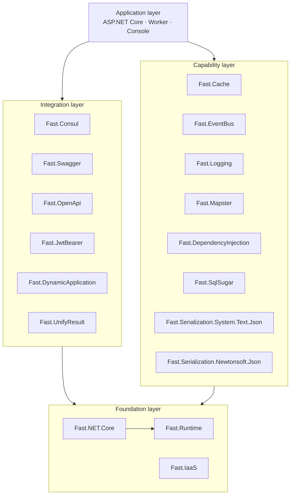
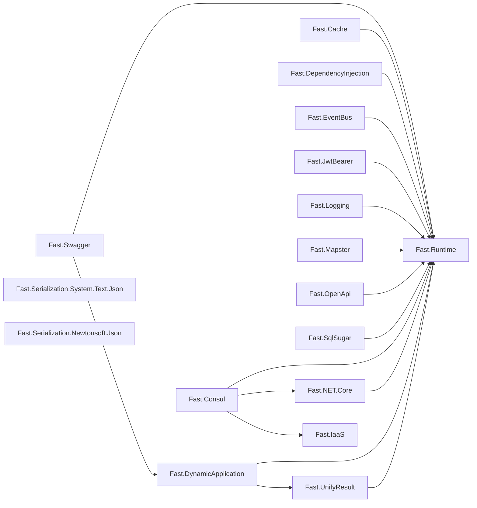
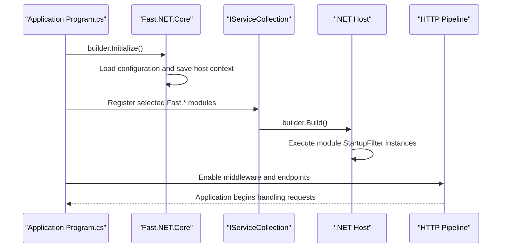

[简体中文](ARCHITECTURE.zh.md) | [**English**](ARCHITECTURE.md) · [Back to README](../README.md)

# Fast.NET Architecture

This document describes Fast.NET module boundaries, actual project references, application startup, and compatibility strategy. The overview diagram in the README presents the conceptual layers; the `.csproj` references in this repository remain authoritative.

## Design goals

Fast.NET follows these principles:

1. **Package capabilities independently**: every module is published separately, so consumers pay only for selected dependencies.
2. **Keep dependencies directional**: integration modules may depend on foundations, while foundations remain unaware of higher-level integrations.
3. **Use idiomatic .NET extension points**: service registration, application construction, and middleware activation build on standard host abstractions.
4. **Isolate framework differences**: multi-target projects use conditional compilation or conditional package references.
5. **Keep general utilities lightweight**: `Fast.IaaS` does not depend on ASP.NET Core and targets `netstandard2.1`.

## Module layers

### Foundation layer

- **Fast.Runtime**: shared ASP.NET Core runtime, context, configuration, and extensions used by most web modules.
- **Fast.NET.Core**: application initialization, configuration discovery, CORS, compression, request buffering, and other application-level foundations.
- **Fast.IaaS**: host-independent extensions, validation, file, encoding, and cryptography utilities.

### Capability layer

Caching, logging, event handling, object mapping, dependency injection, data access, and two serialization implementations live in this layer. They can be composed independently; applications normally select one serialization package.

### Integration layer

Authentication, unified responses, dynamic APIs, Swagger, OpenAPI, and Consul sit at application or external-system boundaries and may depend on foundations or selected peer integrations.

## Actual project references

The following graph includes repository `ProjectReference` edges only, not third-party NuGet dependencies:

The serialization packages and `Fast.IaaS` have no repository project references and are suitable for independent consumption. Third-party dependencies include CSRedisCore, Consul, Mapster, Newtonsoft.Json, SqlSugar, and Swashbuckle.AspNetCore; consult each `.csproj` for authoritative versions.

## Application startup

`Initialize()` establishes core host and configuration state. Other capabilities are registered through module extension methods; selected web modules use `IStartupFilter` to participate in host startup.

## Compatibility and distribution

| Scope | Strategy |
| --- | --- |
| Web and infrastructure modules | Build for .NET 6, 7, 8, 9, and 10 together |
| General utility module | `Fast.IaaS` targets .NET Standard 2.1 |
| Framework differences | Isolated through conditional compilation and conditional `PackageReference` items |
| Shared configuration | `Directory.Build.props` owns targets, documentation, package metadata, and output paths |
| SDK selection | `global.json` pins a baseline and allows feature-band roll-forward |
| Published artifacts | Every module produces `.nupkg`, `.snupkg`, and XML documentation |

## Adding a module

New modules should follow these constraints:

1. Place the project under `src/<ModuleName>/` and use the `Fast.<ModuleName>` package name.
2. Inherit shared repository properties instead of repeating target and package metadata.
3. Add only necessary `ProjectReference` items and avoid dependency cycles.
4. Expose host integration through focused extension methods and document public APIs with XML comments.
5. Use target-specific conditional references for framework-specific dependencies.
6. Update the Chinese and English README files, architecture diagrams, and package catalog.
7. Build every affected target and inspect the NuGet package `lib/` layout.

## Related documentation

- [Project README](../README.md)
- [Contribution guide](../CONTRIBUTING.md)
- [Chinese architecture guide](ARCHITECTURE.zh.md)
