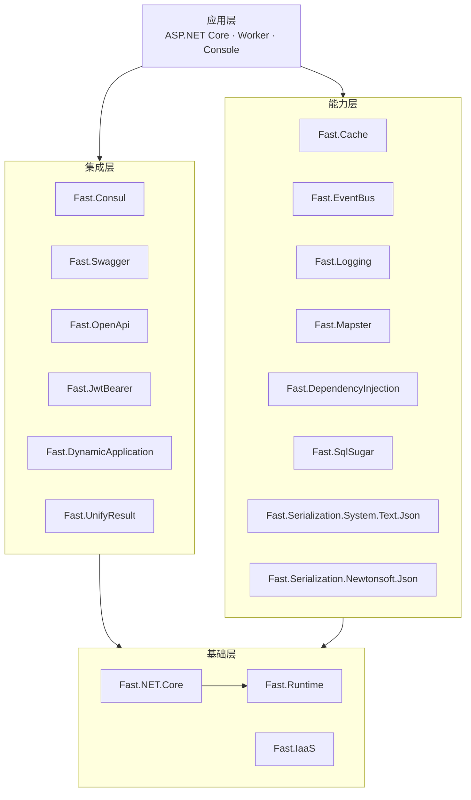
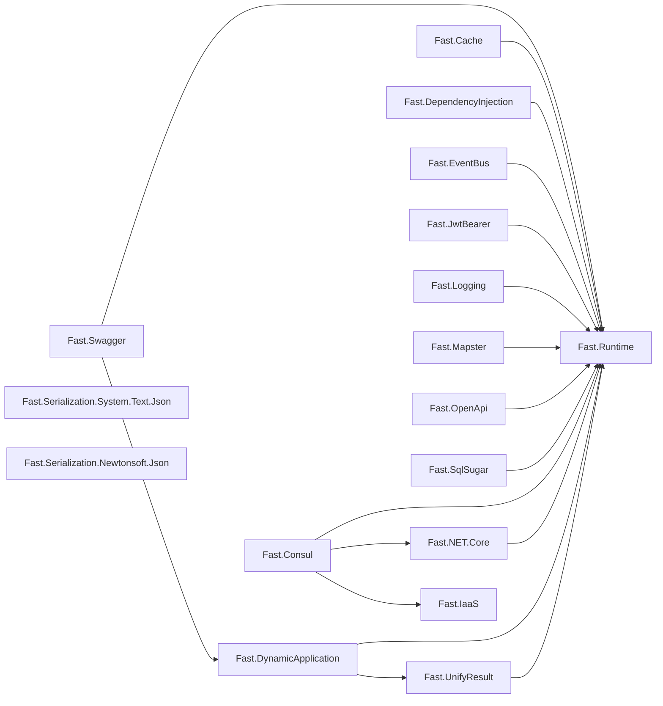
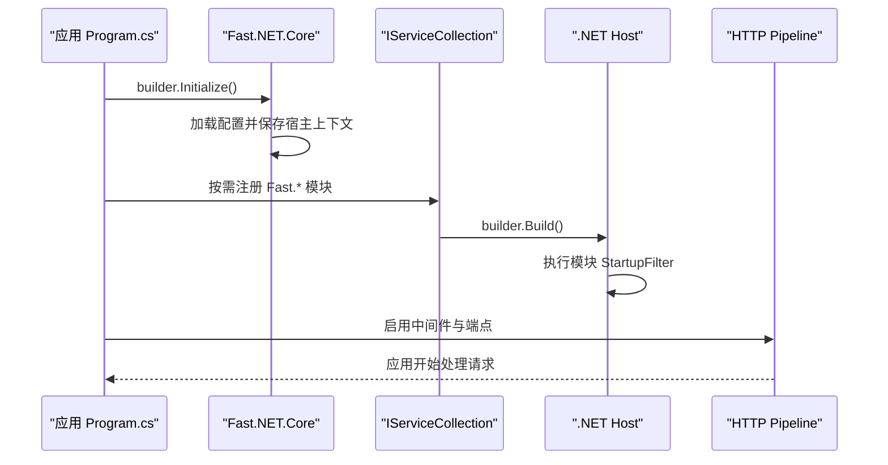

[**简体中文**](ARCHITECTURE.zh.md) | [English](ARCHITECTURE.md) · [返回 README](../README.zh.md)

# Fast.NET 架构说明

本文描述 Fast.NET 的模块边界、实际项目引用关系、应用启动流程和兼容策略。README 中的架构图用于快速理解分层；本文以仓库中的 `.csproj` 引用为准。

## 设计目标

Fast.NET 遵循以下原则：

1. **能力按包拆分**：每个模块独立发布，使用方只承担所选能力的依赖成本。
2. **依赖保持单向**：上层集成模块可以依赖基础模块，基础模块不反向感知业务集成。
3. **优先使用 .NET 惯用扩展点**：服务注册、应用构建和中间件启用分别围绕标准宿主抽象实现。
4. **跨版本 API 隔离**：多目标项目使用条件编译或条件包引用处理框架差异。
5. **通用工具保持轻量**：`Fast.IaaS` 不依赖 ASP.NET Core，并以 `netstandard2.1` 发布。

## 模块分层

### 基础层

- **Fast.Runtime**：ASP.NET Core 共享运行时、上下文、配置与通用扩展，是多数 Web 模块的基础依赖。
- **Fast.NET.Core**：应用初始化、配置文件扫描、CORS、压缩、请求缓冲等应用级核心能力。
- **Fast.IaaS**：与 Web 宿主无关的通用扩展、校验、文件、编码和密码学工具。

### 能力层

缓存、日志、事件总线、对象映射、依赖注入、数据访问和两种序列化实现位于此层。它们可以按需组合，其中两个序列化包通常二选一。

### 集成层

认证、统一响应、动态 API、Swagger、OpenAPI 和 Consul 面向应用边界或外部系统，允许依赖基础层和必要的其他集成模块。

## 实际项目引用关系

下图只表示仓库内 `ProjectReference`，不包含第三方 NuGet 依赖：

序列化包和 `Fast.IaaS` 没有仓库内项目依赖，因此适合被独立引用。第三方依赖包括 CSRedisCore、Consul、Mapster、Newtonsoft.Json、SqlSugar、Swashbuckle.AspNetCore 等，具体版本以对应 `.csproj` 为准。

## 应用启动流程

`Initialize()` 负责核心宿主和配置初始化。其他能力通过各模块扩展方法注册；部分 Web 模块通过 `IStartupFilter` 将必要行为接入宿主启动过程。

## 兼容与发布策略

| 范围 | 策略 |
| --- | --- |
| Web 与基础设施模块 | 同时面向 .NET 6、7、8、9、10 构建 |
| 通用工具模块 | `Fast.IaaS` 面向 .NET Standard 2.1 |
| 框架差异 | 通过条件编译和条件 `PackageReference` 隔离 |
| 统一配置 | `Directory.Build.props` 管理目标框架、文档、包元数据和输出目录 |
| SDK 选择 | `global.json` 固定基线并允许 feature-band 滚动 |
| 发布产物 | 每个模块生成 `.nupkg`、`.snupkg` 和 XML 文档 |

## 扩展新模块

新增模块时建议遵循以下约束：

1. 将项目放在 `src/<ModuleName>/`，并使用 `Fast.<ModuleName>` 包名。
2. 优先继承仓库统一构建属性，不在项目中重复目标框架和打包元数据。
3. 仅添加必要的 `ProjectReference`，避免形成循环依赖。
4. 面向宿主的注册入口使用清晰的扩展方法，并为公共 API 编写 XML 文档。
5. 框架专属依赖使用按 `TargetFramework` 区分的条件引用。
6. 更新中英文 README、架构图和模块目录。
7. 构建所有受影响目标框架，并检查 NuGet 包中的 `lib/` 目录。

## 相关文档

- [项目主页](../README.zh.md)
- [贡献指南](../CONTRIBUTING.zh.md)
- [英文架构说明](ARCHITECTURE.md)
